# DEMO

転倒検知アプリケーションの詳細な技術構成について説明します。

## ROS2 Components

この Mermaid フローチャートは、[ros2_graph](https://github.com/kiwicampus/ros2_graph) によって生成しています。

```mermaid
flowchart LR
    /out/compressed(["/out/compressed<br>sensor_msgs/msg/CompressedImage"]) --> /display["/display"] & /pose_requester["/pose_requester"]
    /pose(["/pose<br>std_msgs/msg/String"]) --> /display
    /image_raw/compressed(["/image_raw/compressed<br>sensor_msgs/msg/CompressedImage"]) --> /image_republisher["/image_republisher"]
    /image_republisher --> /out/compressed
    /pose_requester --> /pose
    /v4l2_camera["/v4l2_camera"] --> /image_raw/compressed

    /out/compressed:::topic
    /display:::main
    /pose_requester:::main
    /pose_requester:::node
    /pose:::topic
    /image_raw/compressed:::topic
    /image_republisher:::main
    /image_republisher:::node
    /v4l2_camera:::main
    /v4l2_camera:::node
    classDef node opacity:0.9,fill:#2A0,stroke:#391,stroke-width:4px,color:#fff
    classDef action opacity:0.9,fill:#66A,stroke:#225,stroke-width:2px,color:#fff
    classDef service opacity:0.9,fill:#3B8062,stroke:#3B6062,stroke-width:2px,color:#fff
    classDef topic opacity:0.9,fill:#852,stroke:#CCC,stroke-width:2px,color:#fff
    classDef main opacity:0.9,fill:#059,stroke:#09F,stroke-width:4px,color:#fff
    classDef bugged opacity:0.9,fill:#933,stroke:#800,stroke-width:2px,color:#fff

```

### Nodes

- **/v4l2_camera**
  - カメラ画像を生成
  - Raw Image: [v4l2_camera](https://index.ros.org/p/v4l2_camera/)
  - Compressed Image: [image_transport](https://wiki.ros.org/image_transport)
  - topics:
    - publication: `/image_raw/compressed`
- **/image_republisher**
  - TB3 <--> Mini-PC のユニキャスト通信を削減するためのプロキシ
  - Mini-PC (Requester) 上で実行
  - topics:
    - subscription: `/image_raw/compressed`
    - publication: `/out/compressed`
- **/pose_requester**
  - MEC-RM に Job を生成
  - topics:
    - subscription: `/out/compressed`
    - publication: `/pose`
- **/display**
  - 画像とポーズを表示
  - topics:
    - subscription: `/out/compressed`
    - subscription: `/pose`

## Future Work

- **/renderer**
  - 画像にポーズを描画
  - topics:
    - subscription: `/pose`
    - publication: `/rendered_image`
- **/display**
  - [`rqt_image_view`](https://wiki.ros.org/rqt_image_view) による画像とポーズの表示
  - 画像表示は既存のパッケージを利用するように変更
