# DEMO

転倒検知アプリケーションの詳細な技術構成について説明します。

## ROS2 Environment

この Mermaid フローチャートは、[ros2_graph](https://github.com/kiwicampus/ros2_graph) によって生成しています。


### Nodes

- **`/v4l2_camera`**:

  カメラ画像を生成するためのノード。ROS2 の [v4l2_camera](https://index.ros.org/p/v4l2_camera/) パッケージを利用しています。
  また、カメラ画像を JPEG 圧縮するための [image_transport](https://wiki.ros.org/image_transport) パッケージをプラグインとして利用しています。

  - topics:
    - publication: `/image_raw/compressed`

- **`/image_republisher`**:

  TB3 から Mini-PC への画像転送を効率化するためのプロキシ。TB3 からの画像トピックを受信し、Mini-PC 内で再配信する。
  これにより、TB3 <--> Mini-PC 間のユニキャストを 1 本にし、Raspberry Pi の負荷を軽減します。

  - topics:
    - subscription: `/image_raw/compressed`
    - publication: `/out/compressed`

- **`/pose_requester`**:

  MEC-RM に対して、OpenPose によるポーズ推定をリクエストするためのノードです。

  - topics:
    - subscription: `/out/compressed`
    - publication: `/pose`

- **`/display`**:
  
  画像とポーズのキーポイントをマージして表示するためのノードです。
  将来的に、マージプロセスを分離し、`rqt_image_view` などの既存のツールを利用するように変更する予定です。

  - topics:
    - subscription: `/out/compressed`
    - subscription: `/pose`

### Configuration

[compose.yml](../compose.yml) の環境変数から、ある程度の設定が可能となっています。

```yml
    environment:
      # don't modify
      - DISPLAY=$DISPLAY

      # ROS2 settings
      - ROS_DOMAIN_ID=33

      # display settings
      - POSE_THRESHOLD=0.45
      - DISPLAY_SCALE=1.5

      # requester settings
      - PLEIADES_HOST=http://localhost/api/v0.5/
      - MAX_JOB=5
      - POSE_FPS=10
```

- **`POSE_THRESHOLD`**:

  転倒検知の判定を行う閾値を変更します。値は 0 ~ 1 の範囲で指定します。
  値は、OpenPose に入力した画像の解像度において、下からの割合を表します。

- **`DISPLAY_SCALE`**:

  表示する画像のスケールを変更します。値は、元の画像サイズに対する倍率を表します。
  今後は、`rqt_image_view` などの既存のツールを利用するため、この設定は廃止する予定です。

- **`PLEIADES_HOST`**:

  `/pose_requester` ノードが利用する MEC-RM の URL を指定します。
  環境変数名がホスト名の指定を示していますが、実際には URL を指定します。
  これは、将来的に MEC-RM のホストとバージョンの指定を分離するためです。

- **`MAX_JOB`**:

  `/pose_requester` ノードが同時にリクエストするポーズ推定の最大数です。
  Job を発行すると 1 増加し、結果が返ってくると 1 減少します。
  この値を超える Job が発行された場合、`/out/compressed` トピックのデータを受け取ったとしても、リクエストを行いません。
  また、値を増加させたとしても、スループットが向上するわけではなく、スループットは Worker の GPU 性能に依存します。

- **`POSE_FPS`**:

  `/pose_requester` ノードがポーズ推定をリクエストする頻度を指定します。
  この値は、ポーズ推定のスループットに影響しますが、`MAX_JOB` と同様に、Worker の GPU 性能に依存します。

### Future Work

```mermaid
flowchart LR
    /out/compressed(["/out/compressed<br>sensor_msgs/msg/CompressedImage"]) -->  /pose_requester["/pose_requester"] & /renderer
    /pose(["/pose<br>std_msgs/msg/String"]) --> /renderer
    /image_raw/compressed(["/image_raw/compressed<br>sensor_msgs/msg/CompressedImage"]) --> /image_republisher["/image_republisher"]
    /image_republisher --> /out/compressed
    /pose_requester --> /pose
    /v4l2_camera["/v4l2_camera"] --> /image_raw/compressed
    /renderer --> /rendered_image(["/rendered_image<br>sensor_msgs/msg/CompressedImage"])
    /rendered_image --> /display

    /out/compressed:::topic
    /display:::main
    /pose_requester:::main
    /pose_requester:::node
    /pose:::topic
    /image_raw/compressed:::topic
    /image_republisher:::main
    /image_republisher:::node
    /v4l2_camera:::main
    /v4l2_camera:::node
    /renderer:::node
    /rendered_image:::topic
    classDef node opacity:0.9,fill:#2A0,stroke:#391,stroke-width:4px,color:#fff
    classDef action opacity:0.9,fill:#66A,stroke:#225,stroke-width:2px,color:#fff
    classDef service opacity:0.9,fill:#3B8062,stroke:#3B6062,stroke-width:2px,color:#fff
    classDef topic opacity:0.9,fill:#852,stroke:#CCC,stroke-width:2px,color:#fff
    classDef main opacity:0.9,fill:#059,stroke:#09F,stroke-width:4px,color:#fff
    classDef bugged opacity:0.9,fill:#933,stroke:#800,stroke-width:2px,color:#fff
```



- **`/renderer`**:

  画像とポーズのキーポイントをマージして、新しい画像を生成するノードです。
  このノードにより、任意のツールで画像を表示することが可能となります。

  - topics:
    - subscription: `/pose`
    - publication: `/rendered_image`

- **`/display`**:

  [`rqt_image_view`](https://wiki.ros.org/rqt_image_view) による画像とポーズの表示を行うようにします。

## MEC-RM Worker

Worker のリポジトリは[こちら](https://github.com/CREST-applications/pose-server)です。

[OpenPose](https://github.com/CMU-Perceptual-Computing-Lab/openpose) の環境は、Docker コンテナにまとめています。[Dockerhub](https://hub.docker.com/repository/docker/jme06/openpose/general)

- Model: `BODY_25`
- Input: `640x480`
- Output: `JSON`

## MEC-RM Python Client Library

本プロジェクトでは、`/pose_requester` および Worker が MEC-RM と通信を行うために、[`pymec`](https://github.com/CREST-applications/pymec) を使用しています。

使用方法については、[examples](https://github.com/CREST-applications/pymec/tree/dev/examples) を参照してください。
