# DEMO

これは、介護施設デモのうち、店頭検知アプリケーションのマニュアルです。

## Getting Started

### TurtleBot3 のセットアップ

## 使用技術

- ROS2
  - TurtleBot3 と Requester (Mini-PC) との通信に使用
- OpenPose
  - 画像から人の姿勢を検出するために使用
- MEC-RM
  - OpenPose を実行するマシンを利用するためのミドルウェア

## ROS2 Network

```mermaid
flowchart LR
    /pose(["/pose<br>std_msgs/msg/String"]) --> /display["/display"]
    /proxy(["/proxy<br>sensor_msgs/msg/CompressedImage"]) --> /display & /pose_requester["/pose_requester"]
    /image_raw/compressed(["/image_raw/compressed<br>sensor_msgs/msg/CompressedImage"]) --> /proxy
    /pose_requester --> /pose & /pose
    /v4l2_camera["/v4l2_camera"] --> /image_raw/compressed & /image_raw/compressed

     /pose:::topic
     /display:::main
     /proxy:::main
     /proxy:::node
     /proxy:::topic
     /pose_requester:::main
     /pose_requester:::node
     /image_raw/compressed:::topic
     /v4l2_camera:::main
     /v4l2_camera:::node
    classDef node opacity:0.9,fill:#2A0,stroke:#391,stroke-width:4px,color:#fff
    classDef action opacity:0.9,fill:#66A,stroke:#225,stroke-width:2px,color:#fff
    classDef service opacity:0.9,fill:#3B8062,stroke:#3B6062,stroke-width:2px,color:#fff
    classDef topic opacity:0.9,fill:#852,stroke:#CCC,stroke-width:2px,color:#fff
    classDef main opacity:0.9,fill:#059,stroke:#09F,stroke-width:4px,color:#fff
    classDef bugged opacity:0.9,fill:#933,stroke:#800,stroke-width:2px,color:#fff
```

